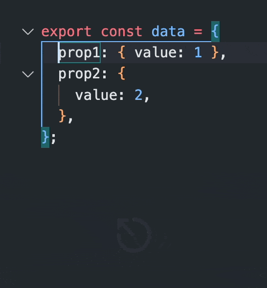
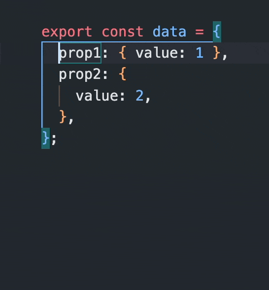

# Ignore Whitespace

Traverse code while ignoring whitespace.

Without Ignore Whitespace (using `Alt + ←/→`):



With Ignore Whitespace:



Recommended modification to `keybindings.json`:

```json
  {
    "key": "cmd+alt+left",
    "when": "editorTextFocus",
    "command": "ignore-whitespace.moveToPrev"
  },
  {
    "key": "cmd+alt+right",
    "when": "editorTextFocus",
    "command": "ignore-whitespace.moveToNext"
  }
```
